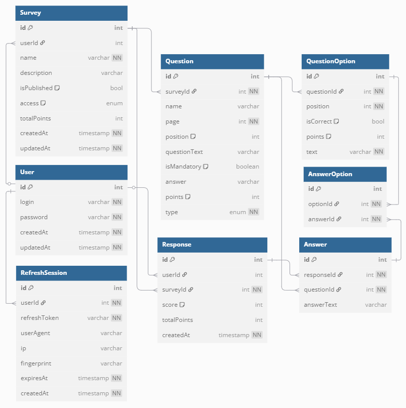

# Multi page forms backend - NestJS + TypeScript + TypeORM + JWT

## Цель проекта

Разработать бэкенд, который будет являться упрощенным аналогом бэкенда Яндекс Форм.

## Задачи

- [X] Регистрация и авторизация по JWT через логин и пароль
- [X] Cоздание формы, поддерживающей поля: текстовое, radio, checkbox
- [X] Получение, изменение и удаление формы по id
- [X] Отправка ответа на форму по id              <--- ***плохая реализация, необходимо переписать по возможности***
- [X] Получение всех своих созданных форм
- [ ] Создание Postman коллекции для тестирования
- [ ] Использование Swagger UI
- [ ] 
Добавить docker-compose.yaml и Dockerfile файлы для развертывания базы данных и самого приложения в Docker контейнере.
- [ ] Реализовать опциональную фильтрацию и сортировку

## Технологии

- **TypeScript** - статическая типизация для повышения надежности кода.
- **TypeORM** - работа с БД.
- **NestJS** - обработка маршрутов.
- **JWT (jsonwebtoken, passport-jwt)** – аутентификация на основе токенов.

## Установка

```bash
$ npm install
```

## Запуск

```bash
# development
$ npm run start

# watch mode
$ npm run start:dev

# production mode
$ npm run start:prod
```

## Запуск тестов

```bash
# unit tests
$ npm run test

# e2e tests
$ npm run test:e2e

# test coverage
$ npm run test:cov
```

## Структура БД

Для обеспечения работы данного проекта база данных содержит 7 сущностей: **User**, **Survey**, **Question**, **Answer**, **Response**, **QuestionOption** и **AnswerOption** в качестве промежуточной таблицы для связи Многие-ко-многим.
  - Один **User** может иметь несколько созданных **Survey**
  - Одна **Survey** может иметь несколько **Question**
  - Один **Question** может иметь несколько **QuestionOption**
  - Одна **Survey** может иметь несколько **Response** (информация о респондентах минимальна, так как опросы анонимны)
  - Один **User** может создать несколько **Response** (редактировать ответы после отправки нельзя)
  - Один **Response** может или должен (в зависимости от обязательности вопроса) иметь несколько **Answer**
  - Один **Question** может иметь несколько **Answer** от разных респондентов
  - Один **Answer** может иметь несколько выбранных **QuestionOption**, также один **QuestionOption** может быть выбран в нескольких **Answer** разными респондентами



## Структура проекта

```
src/
│
│── database/           # Файлы настройки базы данных
│
│── auth/              # Модуль аунтентификации и авторизации
│   ├── dto
│   ├── entities/       # Сущности модуля аунтентификации и авторизации
│   ├── strategies      # Стратегии валидации токенов
│
│── configs/
│── guards/             # Guards для токенов jwt
│
│── questions/          # Модуль вопросов анкеты
│   ├── dto
│   ├── entities/       # Сущности модуля вопросов
│   ├── enums/          # Перечисления для вопросов
│
│── responses/          # Модуль ответов на анкеты
│   ├── entities/       # Сущности модуля ответов
│
│── surveys/            # Модуль анкет
│   ├── dto
│   ├── entities/       # Сущности модуля анкет
│   ├── enums/          # Перечисления для анкет
│
│── users/              # Модуль пользователей
│   ├── dto
│   ├── entities/       # Сущности модуля пользователей
│
│── app.controller.ts
│── app.module.ts
│── app.service.ts
.env
tsconfig.json
package.json
```

## Используемые роуты

### Модуль users

- protected(accesstoken) **GET    /users/self**            - Получение своих данных
- protected(accesstoken) **GET    /users/**                - Получение списка пользователей
- protected(accesstoken) **GET    /users/:userId**         - Получение данных конкретного пользователя
- protected(accesstoken) **PATCH  /users/self**            - Обновление своих данных
- protected(accesstoken) **DELETE /users/self**            - Удаление своего аккаунта

### Модуль auth

- POST                     **/auth/signup**          - Регистрация
- POST                     **/auth/signin**          - Авторизация
- protected(accesstoken)   **DELETE  /auth/logout**  - Удаление сессии
- protected(refreshtoken)  **POST  /auth/refresh**   - Обновление токенов

### Модуль surveys

- protected(accesstoken)   **POST   /surveys/**                      - Создание новой анкеты
- protected(accesstoken)   **GET    /surveys/self**                  - Получение своих анкет
- GET                      **/surveys/public**                       - Просмотр публичных анкет
- protected(accesstoken)   **GET    /surveys/:surveyId**             - Получение данных своей анкеты
- protected(accesstoken)   **PATCH  /surveys/:surveyId**             - Обновление своей анкеты
- protected(accesstoken)   **DELETE /surveys/:surveyId**             - Удаление своей анкеты

### Модуль questions

- protected(accesstoken)   **POST   /surveys/:surveyId/questions**             - Создание нового вопроса в анкете
- protected(accesstoken)   **PATCH  /surveys/:surveyId/questions/:questionId** - Обновление данных вопроса
- protected(accesstoken)   **DELETE /surveys/:surveyId/questions/:questionId** - Удаление вопроса

### Модуль responses

- protected(accesstoken) **GET   /surveys/:surveyId/form**          - Просмотр конкретной анкеты для заполнения
- protected(accesstoken) **POST  /surveys/:surveyId/responses**     - Отправка заполненного ответа
- protected(accesstoken) **GET   /surveys/:surveyId/responses**     - Получение ответов на свою анкету