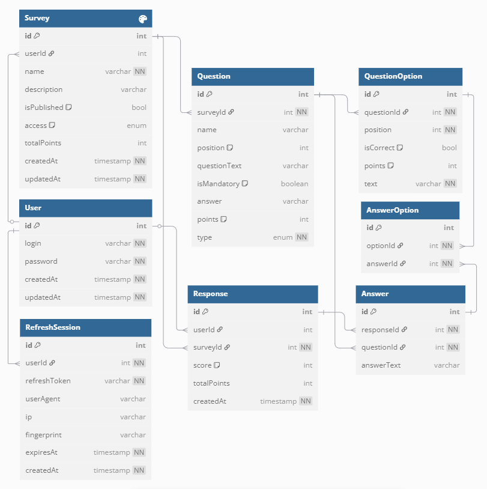

# Multi page forms backend - NestJS + TypeScript + TypeORM

## Цель проекта

Разработать бэкенд, который будет являться упрощенным аналогом бэкенда Яндекс Форм.

## Задачи

- [ ] Регистрация и авторизация по JWT через логин и пароль
- [ ] Cоздание формы, поддерживающей поля: текстовое, radio, checkbox
- [ ] Получение, изменение и удаление формы по id
- [ ] Отправка ответа на форму по id
- [ ] Получение всех своих созданных форм
- [ ] Создание Postman коллекции для тестирования
- [ ] Использование Swagger UI
- [ ] 
Добавить docker-compose.yaml и Dockerfile файлы для развертывания базы данных и самого приложения в Docker контейнере.
- [ ] Реализовать опциональную фильтрацию и сортировку

## Технологии

- **TypeScript** - статическая типизация для повышения надежности кода.
- **TypeORM** - работа с БД.
- **NestJS** - обработка маршрутов.

## Установка

```bash
$ npm install
```

## Запуск

```bash
# development
$ npm run start

# watch mode
$ npm run start:dev

# production mode
$ npm run start:prod
```

## Запуск тестов

```bash
# unit tests
$ npm run test

# e2e tests
$ npm run test:e2e

# test coverage
$ npm run test:cov
```

## Структура БД

Для обеспечения работы данного проекта база данных содержит 7 сущностей: **User**, **Survey**, **Question**, **Answer**, **Repondent**, **QuestionOption** и **AnswerOption** в качестве промежуточной таблицы для связи Многие-ко-многим.
  - Один **User** может иметь несколько созданных **Survey**
  - Одна **Survey** может иметь несколько **Question**
  - Один **Question** может иметь несколько **QuestionOption**
  - Одна **Survey** может иметь несколько **Repondent** (информация о респондентах минимальна, так как опросы анонимны)
  - Один **User** может быть связан с несколькими **Repondent** (каждая отправка заполненной анкеты создает нового респондента, редактировать ответы после отправки нельзя)
  - Один **Repondent** может или должен (в зависимости от обязательности вопроса) иметь несколько **Answer**
  - Один **Question** может иметь несколько **Answer** от разных респондентов
  - Один **Answer** может иметь несколько выбранных **QuestionOption**, также один **QuestionOption** может быть выбран в нескольких **Answer** разными респондентами



## Структура проекта

```
src/
│
│── database/           # Файлы базы данных
│
│── respondents/        # Модуль аунтентификации и авторизации
│   ├── entities/       # Сущности модуля аунтентификации и авторизации
│
│── respondents/        # Модуль ответов респондентов
│   ├── entities/       # Сущности модуля ответов респондентов
│
│── surveys/            # Модуль анкет
│   ├── entities/       # Сущности модуля анкет
│
│── users/              # Модуль пользователей
│   ├── entities/       # Сущности модуля пользователей
│
│── app.controller.ts
│── app.module.ts
│── app.service.ts
.env
tsconfig.json
package.json
```